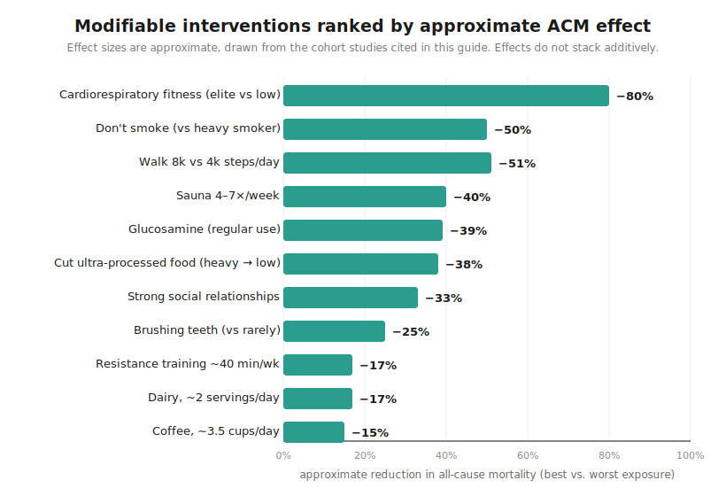
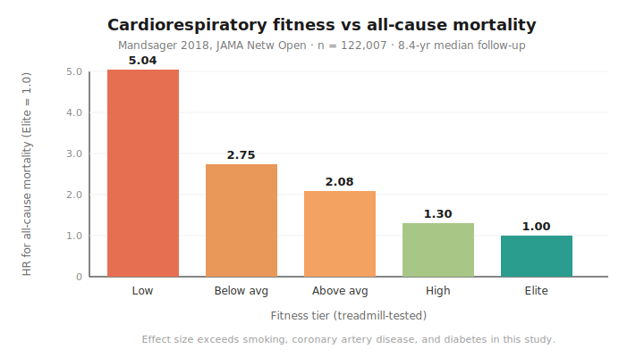
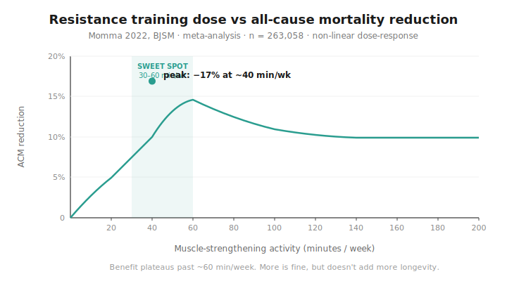
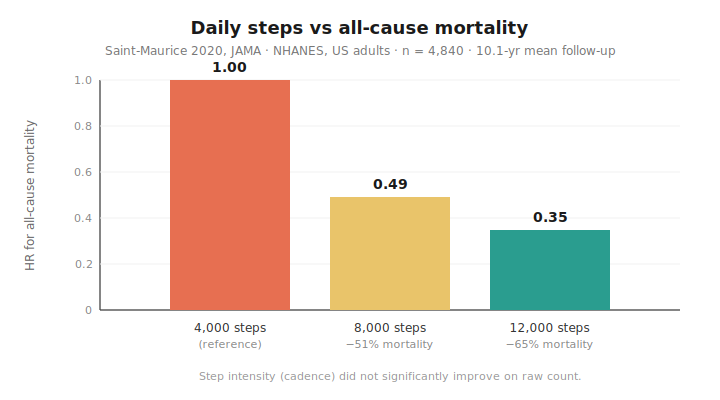

# How to Live Longer — A programmer's guide

An evidence-based summary of the interventions that actually move **all-cause mortality (ACM)** — the probability of dying from any cause in a given period. ACM is the metric academic studies care most about because it can't be gamed by shifting deaths between disease categories.

**Who this is for.** US-based programmers and other knowledge workers, roughly **ages 20 through late 40s**, who want to live longer without giving up the things that make life worth living. The lens is **longevity-first, athletic-aware** — the goal is more years on the clock, but every recommendation should be compatible with training hard, playing intensive sports, lifting weights, or otherwise staying physically engaged. If you're at the older end of that range, the picture shifts a bit (cardiovascular screening becomes more urgent, sarcopenia prevention starts to matter, recovery takes longer); the core levers stay the same.

**What's different about this guide.** Most longevity content (including the [original Chinese-language guide](https://github.com/geekan/HowToLiveLonger) this is forked from) is calibrated for sedentary, middle-aged readers. That makes it light on the things that matter most for active adults — cardiorespiratory fitness, resistance training, social connection, injury prevention — and heavy on things most readers in this age band don't need yet (metformin, weight loss from obesity, age-72+ housework). This version reorders the priorities, swaps in US-relevant evidence, and adds the sections most missing from the original.

**Why programmers specifically?** Because the lifestyle that comes with the job is rough on longevity by default — long sedentary hours, irregular sleep, optimization of work and abandonment of everything else, screen-mediated socialization, easy access to delivery food. None of this is fatal individually; together it stacks. The good news: programmers tend to like systems thinking, optimizing variables, and finding leverage — exactly the disposition this guide rewards.

---

- [1. Glossary](#1-glossary)
- [2. Goals and key results](#2-goals-and-key-results)
- [3. How to read the evidence](#3-how-to-read-the-evidence)
- [4. The action list (TL;DR)](#4-the-action-list-tldr)
- [5. Foundations (the biggest levers)](#5-foundations-the-biggest-levers)
  - [5.1. Cardiorespiratory fitness](#51-cardiorespiratory-fitness-vo2max)
  - [5.2. Resistance training](#52-resistance-training)
  - [5.3. Sleep](#53-sleep)
  - [5.4. Don't smoke or vape](#54-dont-smoke-or-vape)
  - [5.5. Social connection](#55-social-connection)
  - [5.6. Chronic stress](#56-chronic-stress)
- [6. Diet in the US food environment](#6-diet-in-the-us-food-environment)
  - [6.7. Body composition (not weight)](#67-body-composition-not-weight)
- [7. Supplements worth considering (and what to skip)](#7-supplements-worth-considering-and-what-to-skip)
- [8. Sport-specific injury prevention](#8-sport-specific-injury-prevention)
- [9. Recovery and daily habits](#9-recovery-and-daily-habits)
- [10. Mental health and social connection](#10-mental-health-and-social-connection)
- [11. What we de-prioritized from the original guide](#11-what-we-de-prioritized-from-the-original-guide)
- [12. Things you can't change much (but should know)](#12-things-you-cant-change-much-but-should-know)

---

### 1. Glossary

* **ACM** — *all-cause mortality.* Risk of dying from any cause in a given window.
* **HR** — *hazard ratio.* "How many times more likely the exposed group is to die than the control group." HR 1.10 = 10% higher risk; HR 0.50 = 50% lower.
* **CI** — *confidence interval.* The range the true effect probably falls within (95% CI is the convention).
* **RR / OR** — *relative risk / odds ratio.* Similar interpretation to HR for our purposes.
* **VO2max** — peak rate at which your body can use oxygen during exercise. The single best aerobic-fitness measure, and the strongest mortality predictor in the literature.
* **MET** — *metabolic equivalent.* 1 MET ≈ sitting; 4 METs ≈ brisk walk; 10 METs ≈ jogging.
* **Zone 2** — easy steady-state cardio at the upper edge of conversational pace (~60–70% of max HR). The dominant training stimulus for mitochondrial density and aerobic base.

### 2. Goals and key results

* **Live longer, reliably**, by stacking interventions each backed by strong evidence.
* **Realistic stack:** the combined effect of being aerobically fit, lifting 30–60 min/week, not smoking, sleeping well, maintaining close relationships, and eating mostly real food is plausibly **15–25 added years** vs. a sedentary, isolated, ultra-processed-diet baseline. The effects don't stack cleanly (they aren't independent), but the direction across dozens of large studies is unambiguous.

### 3. How to read the evidence

* **ACM is the gold-standard endpoint.** Disease-specific outcomes can be gamed (a diet that "prevents heart disease" but raises cancer the same amount nets zero); ACM can't.
* **Most studies show correlation, not causation.** Healthy people are often *able* to walk more, drink more coffee, sleep regularly, etc. Read with skepticism — but when a finding shows up across many populations, decades, and study designs, it's probably real.
* **Effects don't stack additively.** A −20% intervention plus a −20% intervention rarely yields −36%; you're stacking dependent variables.
* **The literature contradicts itself in places.** Sodium, carb ratios, and bedtime timing are areas where you'll find loud, opposite claims. Be wary of single-study results, especially with self-reported data.
* **Effect size > p-value.** A statistically significant 2% mortality reduction in a 200,000-person study barely matters in practice. A 40% reduction in a 5,000-person study probably matters a lot.

### 4. The action list (TL;DR)

If you do nothing else with this guide, do these:

1. **Become aerobically fit.** Run, bike, row, or swim such that you can comfortably hold Zone 2 for 45+ minutes, and can hit hard intervals once a week. This single factor is the strongest ACM predictor we have. ([§5.1](#51-cardiorespiratory-fitness-vo2max))
2. **Lift 2–3× per week.** 30–60 min/week of resistance training is the sweet spot. ([§5.2](#52-resistance-training))
3. **Sleep ~7–9 hours, on a consistent schedule.** ([§5.3](#53-sleep))
4. **Don't smoke, don't vape, drink alcohol minimally.** ([§5.4](#54-dont-smoke-or-vape))
5. **Maintain real, in-person social relationships.** Loneliness has a mortality effect comparable to smoking. ([§5.5](#55-social-connection), [§10](#10-mental-health-and-social-connection))
6. **Cut ultra-processed food.** UPF is 57% of average US calories — every percentage point you replace with whole food matters. ([§6](#6-diet-in-the-us-food-environment))
7. **Eat enough protein.** As an active adult, target 1.4–2.0 g/kg/day (≈0.6–0.9 g/lb), not the sedentary RDA of 0.8 g/kg. ([§6](#6-diet-in-the-us-food-environment))
8. **Train and play in ways that don't blow out your joints.** A torn ACL at 21 means osteoarthritis at 40. Knee/ankle health compounds for decades. ([§8](#8-sport-specific-injury-prevention))
9. **Manage chronic stress.** Sustained psychosocial stress carries a population-attributable risk for heart attack roughly comparable to abdominal obesity. ([§5.6](#56-chronic-stress))

#### Quick reference — the numbers

| Lever | Target | Section |
|---|---|---|
| Zone 2 cardio | 2–4 hours/week | [§5.1](#51-cardiorespiratory-fitness-vo2max) |
| Vigorous intervals | 15–60 min/week | [§5.1](#51-cardiorespiratory-fitness-vo2max) |
| Resistance training | ~40 min/week (range 30–60) | [§5.2](#52-resistance-training) |
| Sleep | 7–9 hours, consistent ±30 min | [§5.3](#53-sleep) |
| Daily steps | 8,000+ as a floor | [§9.1](#91-walking) |
| Protein | 1.4–2.0 g/kg/day (≈0.6–0.9 g/lb) | [§6.2](#62-protein-for-active-adults) |
| Fiber | 30+ g/day | [§6.4](#64-vegetables-fruit-fiber-flavonoids) |
| Sitting | <6 hours/day; break every 30–60 min | [§9.2](#92-sitting) |
| Coffee | up to ~3.5 cups/day (no sugar) | [§6.5](#65-drinks) |
| Alcohol | minimize; no clearly safe dose | [§5.4](#54-dont-smoke-or-vape) |
| Smoking / vaping | zero | [§5.4](#54-dont-smoke-or-vape) |
| Creatine | 3–5 g/day, indefinitely | [§7.1](#71-creatine--yes) |
| Vitamin D | check level; supplement if <30 ng/mL | [§7.2](#72-vitamin-d--probably-if-youre-deficient) |
| Omega-3 (EPA+DHA) | 1–2 g/day if not eating fatty fish 2×/wk | [§7.3](#73-omega-3-epa--dha--yes-if-you-dont-eat-fish) |
| Glucosamine | 500–1,000 mg/day | [§7.5](#75-glucosamine--surprisingly-strong-evidence) |
| Sauna | 20+ min, 3–4×/week if available | [§9.5](#95-sauna) |
| Sun exposure | daily, especially morning | [§9.3](#93-sun-exposure) |
| Close in-person relationships | recurring weekly+ contact | [§5.5](#55-social-connection), [§10](#10-mental-health-and-social-connection) |
| Body fat % (population health) | M: 10–22%; W: 18–32% | [§6.7](#67-body-composition-not-weight) |
| Waist circumference | M: <40"; W: <35" | [§6.7](#67-body-composition-not-weight) |
| Baseline labs (by mid-20s) | lipid panel + ApoB + Lp(a), A1c, BP | [§12.2](#122-genetics-and-family-history) |
| Coronary calcium (CAC) scan | by age 40, sooner with family hx | [§12.2](#122-genetics-and-family-history) |

Note on what changes by decade. In your 20s and into your 30s, the #1 cause of death in the US is unintentional injury — motor-vehicle crashes and overdose dominate. Seatbelts, sober driving, and avoiding fentanyl-contaminated drugs probably save more expected years than any dietary intervention in this guide. By your late 30s and 40s, the curve crosses over: cancer and cardiovascular disease overtake accidents, and the foundations you've been building (or not) start to show. The interventions below address both — but at the younger end, don't lose sight of the boring stuff, and at the older end, get your numbers checked ([§12.2](#122-genetics-and-family-history)).

---

### 5. Foundations (the biggest levers)

#### 5.1. Cardiorespiratory fitness (VO2max)

**This is the headline finding of the entire longevity literature, and most people have never heard it.**

In a 2018 study of **122,007 patients** undergoing exercise treadmill testing, with a median 8.4-year follow-up, **elite-fitness vs. low-fitness adjusted HR for ACM was 0.20** (95% CI 0.16–0.24) — meaning the lowest-fitness group died at **roughly 5× the rate** of the highest-fitness group. The effect size exceeded coronary artery disease, smoking, and diabetes. There was no upper limit to the benefit; even elite vs. "high" fitness had HR 0.77.

* **Source:** Mandsager K, et al. [*Association of Cardiorespiratory Fitness With Long-term Mortality Among Adults Undergoing Exercise Treadmill Testing*](https://jamanetwork.com/journals/jamanetworkopen/fullarticle/2707428). JAMA Netw Open. 2018.

Meta-analytic data from Kodama et al. (JAMA, 2009): **every 1-MET increase in fitness reduces ACM by ~13% and CVD mortality by ~15%.** A 1-MET difference is the difference between being able to jog a 10-min mile vs. an 11-min mile.

**What to do:**
* **Zone 2 cardio, 2–4 hours per week.** Easy steady-state — you should be able to hold a conversation, just barely. Running, cycling, rowing, brisk hiking all work. This builds your aerobic base and mitochondrial density.
* **One harder session per week.** 4×4-minute intervals at ~90% max HR (the "Norwegian 4×4" protocol) is the most studied VO2max-builder. Hill sprints, threshold runs, or pickup-basketball-with-intent all qualify.
* **For intensive sports (basketball, soccer, tennis, ultimate, climbing, MMA, etc.):** the games themselves are *not* substitutes for structured cardio. Game pace is intermittent and skill-driven; you need dedicated Zone 2 + interval work to build the aerobic engine that lets you actually perform at full intensity for the full duration.

#### 5.2. Resistance training

In a 2022 meta-analysis of **16 cohort studies and 1.5+ million participants**, muscle-strengthening activities were associated with **10–17% lower ACM, CVD, cancer, diabetes, and lung-cancer mortality**. The dose-response curve is non-linear and peaks at roughly **30–60 minutes per week**, with the lowest ACM at **~40 min/week**. More is fine — the benefit just plateaus.

* **Source:** Momma H, et al. [*Muscle-strengthening activities are associated with lower risk of all-cause, cancer and cardiovascular disease mortality*](https://pmc.ncbi.nlm.nih.gov/articles/PMC9209691/). Br J Sports Med. 2022.

Note that this "30–60 minutes" is *time spent lifting*, not time at the gym. Two 45-minute strength sessions per week, mostly compound lifts, hits the target with plenty of room to spare.

**What to do:**
* **2–3 lifting sessions per week** built around compound movements: squat, deadlift / RDL, bench press, overhead press, row, pull-up.
* **Progressive overload.** Add load or reps over time; track it.
* **Don't skip lower body.** Quad and hip strength are the biggest determinants of long-term knee health and fall risk — yes, fall risk in your 70s starts with what you do now.

#### 5.3. Sleep

Sleep is where every other intervention in this guide either pays off or doesn't. It's also the one most people in their 20s underrate.

* **Duration:** 7–9 hours/night is the ACM minimum. Both <6 and >10 hours are associated with higher mortality (though the high end is partly reverse causation — sick people sleep more).
* **Consistency matters as much as duration.** Going to bed and waking up at variable times raises cardiovascular risk independent of total sleep.
* **For training:** sleep is when muscle protein synthesis, glycogen restoration, and CNS recovery happen. There is no supplement, recovery modality, or training hack that substitutes for it.

**What to do:** dark room, cool room, consistent schedule (±30 min) including weekends, no alcohol within 3 hours of bed, no caffeine after ~2 pm if you're sensitive, phone out of the bedroom if you can swing it.

#### 5.4. Don't smoke or vape

Smokers lose an average of **11–12 years of life expectancy**. Even <10 cigarettes/day raises ACM by **~17%** vs. never-smokers; ≥10/day raises it by **~54%**. The biggest disease links are respiratory cancer, COPD, and GI/vascular disease.

* **Source:** Pirie K, et al. Lancet. 2013 (Million Women Study).

Vaping is newer and the long-term data is thinner, but the early evidence strongly suggests it's a bad bet — nicotine is vasoconstrictive regardless of delivery vehicle, and several vape constituents (vitamin E acetate, certain flavorings, fine particulates) have established harms.

**Alcohol.** The "moderate drinking is healthy" finding from the 1990s has not held up under modern reanalysis. The current consensus is that there is no risk-free level, and the cleanest finding from large prospective studies is that less is better. Heavy drinking adds ~50% to ACM with no clear ceiling. Practical version for someone in their 20s: don't drink during the week, keep weekend drinking in single digits per session, never drive after even one drink.

#### 5.5. Social connection

The 2010 Holt-Lunstad meta-analysis pooled **148 studies and 308,849 participants** and found that strong social relationships are associated with a **50% increased likelihood of survival** (OR 1.50, 95% CI 1.42–1.59). The authors compared the effect size to smoking 15 cigarettes per day — and stronger than the effect of obesity or physical inactivity.

* **Source:** Holt-Lunstad J, Smith TB, Layton JB. [*Social Relationships and Mortality Risk: A Meta-analytic Review*](https://journals.plos.org/plosmedicine/article?id=10.1371/journal.pmed.1000316). PLoS Med. 2010.

The US Surgeon General issued a [2023 advisory](https://www.hhs.gov/sites/default/files/surgeon-general-social-connection-advisory.pdf) specifically on loneliness as a public health crisis, citing rising isolation among young adults, especially young men.

**What to do** (and yes, this section feels weird in a longevity doc — that's the problem):
* Default to **in-person** time over text/DMs/Discord. The mortality effect is specifically about face-to-face contact.
* Build at least one **third place** outside work and home: a gym, a basketball league, a regular pickup spot, a climbing gym, a recurring dinner.
* If you're struggling, get a therapist. Therapy access is one of the genuine privileges of US healthcare when it works; use it. See [§10](#10-mental-health-and-social-connection).

#### 5.6. Chronic stress

Stress belongs in Foundations, not in the "soft skills" footer.

The INTERHEART study — Yusuf et al., 27,000+ people across 52 countries — assessed nine modifiable risk factors for first myocardial infarction. **Psychosocial stress (work stress, financial stress, major life events, depression) had an odds ratio of 2.67 and a population-attributable risk of 32.5%** — comparable to abdominal obesity and roughly half the PAR of smoking. The nine factors together accounted for 90% of MI risk in men and 94% in women.

* **Source:** Yusuf S, Hawken S, et al. [*Effect of potentially modifiable risk factors associated with myocardial infarction in 52 countries (the INTERHEART study)*](https://pubmed.ncbi.nlm.nih.gov/15364185/). Lancet. 2004.

The distinction that matters is **chronic** vs. acute stress. Acute stress (a deadline, a hard workout, an argument) is normal and often productive — the body's stress response evolved for it. The problem is *sustained* stress that never resolves: weeks of high cortisol with blunted diurnal variation, which drives hypertension, glucose dysregulation, visceral fat deposition, sleep disruption, immune suppression, and a cascade of behavioral effects (overeating, drinking, doomscrolling, social withdrawal).

For programmers specifically, the chronic-stress triggers are well-documented but rarely treated as health issues: on-call rotations that disrupt sleep, perpetual context-switching, post-deploy adrenaline cycles, deadline-driven 60+ hour weeks treated as normal, social isolation from remote work, and the slow-burn of building things that don't ship.

**What actually works:**
* **Exercise is the most-evidenced anxiolytic.** Both aerobic and resistance training reduce anxiety and depressive symptoms in RCTs with effect sizes comparable to SSRIs in mild-to-moderate cases. This is the highest-leverage stress intervention.
* **Sleep.** Stress and sleep are bidirectional — poor sleep amplifies stress reactivity, and chronic stress wrecks sleep. Fixing one usually helps the other ([§5.3](#53-sleep)).
* **Mindfulness / meditation.** MBSR (Mindfulness-Based Stress Reduction) has solid RCT evidence — typical effect: 20–30% reduction in self-reported anxiety, with smaller but real reductions in cortisol. Apps like Waking Up or Headspace are reasonable on-ramps.
* **Therapy — specifically CBT** for chronic anxiety and depression. Strongest evidence base of any psychological intervention. See [§10](#10-mental-health-and-social-connection).
* **Social connection.** Acute stressors hurt less when you're not facing them alone — this is one mechanism behind the social-connection mortality effect.
* **Time off screens.** Both phone and computer. The dose-response for self-reported stress is real, especially with social media.
* **Hard limits on work.** Most programmers won't say no to one more sprint, one more bug, one more thing — until they crash. The professional ceiling on stress-tolerable hours is ~50/week for sustained periods. Past that, you are not being more productive; you are accruing health debt.

**What doesn't work well enough to bother with:** generic "wellness" products, adaptogens (ashwagandha has mild RCT evidence but smaller than exercise; rhodiola, holy basil, etc. are weaker), CBD for chronic stress (data is thin), expensive retreats. The unsexy stuff above does the actual work.

---

### 6. Diet in the US food environment

The US food environment is not the same one most longevity literature was written about. As of the most recent NHANES data, **ultra-processed foods (UPF) make up roughly 57% of average US adult calories.** That's the load-bearing fact for this section.

* **Source:** Juul F, et al. [*Ultra-processed food consumption among US adults from 2001 to 2018*](https://pubmed.ncbi.nlm.nih.gov/35234813/). Am J Clin Nutr. 2022.

#### 6.1. Cut ultra-processed food

UPF is the category that includes most packaged snacks, sugar-sweetened drinks, fast-food items, industrial bread, sweetened breakfast cereals, frozen pizzas, and most "protein bars." It is *not* synonymous with "processed" — frozen vegetables, plain yogurt, canned beans, oats, and frozen wild fish are minimally processed and fine.

The BMJ SUN cohort (Spain, 19,899 participants) found people in the top quartile of UPF intake had **62% higher ACM** than the bottom quartile. The mechanism is contested (energy density, additives, displacement of nutrient-dense foods, all three), but the signal is robust across cohorts.

* **Source:** Rico-Campà A, et al. [*Association between consumption of ultra-processed foods and all cause mortality: SUN prospective cohort study*](https://www.bmj.com/content/365/bmj.l1949.full). BMJ. 2019.

**Practical rule:** if it has more than ~5 ingredients on the label, or any you don't recognize, treat it as occasional food. If it advertises a health claim on the front of the package, be extra skeptical — that's a strong signal of UPF.

#### 6.2. Protein for active adults

The US RDA for protein is **0.8 g/kg/day**, which is the *minimum to prevent deficiency in a sedentary adult*. It is not the optimal intake for someone who lifts and plays sports.

The International Society of Sports Nutrition position stand on protein and exercise recommends **1.4–2.0 g/kg/day for active individuals**, with the higher end of that range during caloric deficits or aggressive training blocks.

* **Source:** Jäger R, et al. [*ISSN Position Stand: Protein and Exercise*](https://jissn.biomedcentral.com/articles/10.1186/s12970-017-0177-8). JISSN. 2017.

For a 75 kg (165 lb) lifter, that's roughly **105–150 g protein per day**, spread across 3–5 feedings of 25–40 g each (the per-meal cap on muscle protein synthesis is somewhere around 0.4 g/kg per meal).

**Good US-supermarket sources:** Greek yogurt (~17 g/cup), cottage cheese (~25 g/cup), eggs (~6 g each), chicken breast (~30 g per 100 g cooked), salmon (~25 g per 100 g cooked), lean ground beef (~25 g per 100 g cooked), whey protein powder (~25 g per scoop), lentils (~18 g/cup cooked), tofu (~20 g per 100 g), tempeh (~20 g per 100 g).

#### 6.3. Red meat, white meat, and fish

Source: [JAMA Internal Medicine, 2020](https://jamanetwork.com/journals/jamainternalmedicine/articlepdf/2759737/jamainternal_zhong_2020_oi_190112.pdf). Half a daily serving of red meat (≈14 g processed or 40 g unprocessed) raises 8-year ACM by **10%** (HR 1.10, 95% CI 1.04–1.17). Two weekly servings of red or processed meat raises ACM by ~3%. Poultry and fish don't show this effect.

**Practical version:** poultry and fish are your main animal proteins. Red meat 1–2× per week is fine. Processed meat (bacon, hot dogs, deli) is the real category to keep occasional — these carry the strongest ACM signal in the meat literature.

#### 6.4. Vegetables, fruit, fiber, flavonoids

The boring advice is the right advice: eat a lot of plants. **200 g/day of fresh fruit** (≈2 medium fruits) is associated with **−17% mortality** (Global Dietary Database, 2019). Flavonoid-rich foods — apples, berries, citrus, tea, broccoli, kale — were associated with **−20% mortality** in the Danish Diet Cancer and Health cohort (Nature Communications, 2019).

**Target:** at least one serving of vegetables at each main meal, one or two fruits per day, and ~30 g of fiber per day (the average US adult gets ~15). Beans, lentils, oats, berries, broccoli, and whole grains are the easy fiber wins in a US grocery store.

For context on how macro intakes relate to mortality, the UK Biobank prospective cohort (Ho et al., BMJ 2020) found:

Lowest ACM diet pattern in that study: **10–30 g fiber, 14–30% protein, 10–25% monounsaturated fat, 5–7% polyunsaturated fat, 20–30% starch.** Translation in plain language: lots of fiber, plenty of protein, olive oil and nuts for fat, modest grains.

#### 6.5. Drinks

* **Coffee.** A 40-study meta-analysis (~3.85M people) finds non-linear dose-response: **~3.5 cups/day yields the lowest ACM (RR 0.85)**. Diminishing returns after that. Decaf and caffeinated both show benefit. Don't add sugary creamers and undo the effect.
* **Tea.** Daily tea drinkers vs. never: HR ~0.92 for ACM in large cohorts. Both green and black work.
* **Milk and dairy.** PURE study (~130k people, 21 countries): two daily servings of dairy → **−17% ACM, −23% CVD mortality, −33% stroke risk** vs. none. The "dairy is bad" narrative is not well supported.
* **Sugar-sweetened drinks.** Each daily 12-oz serving: **+11% ACM**. Two/day: **+21% ACM, +31% CVD mortality**. Includes "sports drinks" with sugar.
* **Artificially-sweetened ("diet") drinks.** *Worse* than sugar-sweetened in the JAMA Internal Medicine 10-European-country cohort: **+27% ACM** per daily serving. Mechanism unclear; the data is what it is. If you drink a lot of diet soda, treat it as a habit worth phasing down.

* **Fruit juice.** Per a JAMA sub-journal analysis, each daily 12-oz serving of juice is associated with **+24% ACM**. Eat the fruit, don't drink it.
* **Alcohol.** Covered in [§5.4](#54-dont-smoke-or-vape). Short version: there is no clearly safe dose; less is better.

#### 6.6. The contested stuff (don't over-index)

* **Sodium.** The literature is genuinely split. A 181-country analysis (Eur Heart J 2021) found *positive* correlations between sodium intake and life expectancy, and *negative* correlations with ACM. But low-sodium-salt trials in China and elsewhere show clear cardiovascular benefit. Practical version: if your blood pressure is normal, don't obsess over salt; if it's high, your doctor's advice supersedes any blog post.
* **Carb ratios.** Lancet Public Health (2018): **~50% of calories from carbs is the longevity sweet spot**. Very low-carb and very high-carb diets both show shorter lifespans. The "carbs are evil" narrative is not consistent with the largest cohort data.

* **Seed oils.** Currently a contested topic in online nutrition discourse. The strongest meta-analytic data still supports replacing saturated fat with polyunsaturated fat for cardiovascular outcomes; the case against seed oils is largely mechanistic and based on small studies. Don't make this a stress.

#### 6.7. Body composition (not weight)

For active adults, BMI is a misleading metric. Muscular lifters routinely qualify as "overweight" by BMI while being metabolically excellent. What actually matters is **the ratio of fat to lean mass, and especially where the fat is.**

* **Visceral fat is the dangerous fat.** Subcutaneous fat (under the skin, especially on hips/thighs) is metabolically pretty inert. Visceral fat (deep abdominal, wrapped around organs) is metabolically active — it drives insulin resistance, chronic inflammation, and cardiovascular risk independent of total body fat. The "skinny-fat" pattern — lean-looking but sedentary, high visceral fat — is real and metabolically worse than being heavier-but-active.
* **Body fat percentage** (population-health ranges, not athletic-aesthetics ranges):

  | | Healthy | Concerning | Obese |
  |---|---|---|---|
  | Men | 10–22% | >25% | >30% |
  | Women | 18–32% | >32% | >38% |

* **Waist circumference** is a free, rough proxy for visceral fat. NIH thresholds for elevated cardiometabolic risk: **men >40", women >35"**. Waist-to-height ratio <0.5 is the simpler version of the same idea.
* **Caveat for athletes:** dropping below ~10% (men) or ~18% (women) year-round costs you sleep, hormonal function, and recovery. Cycle leaner phases if you want competition-level conditioning; don't try to maintain them permanently.

**How to actually measure it:**

| Method | Accuracy | Cost | Notes |
|---|---|---|---|
| DEXA scan | Gold standard | $50–$150 | Annual is plenty. Some scanners report visceral fat directly. Also gives bone density. |
| InBody / BIA at a gym | ±5% | Free–$30 | Useful for trends, not absolutes. Hydration changes the reading. |
| Skinfold calipers | ±3–5% | $10 | Only if someone experienced uses them on you. |
| Tape measure (waist) | Rough | Free | Sufficient if you just want to track the trend. |
| Mirror | Qualitative | Free | Actually useful. You know what fit you looks like. |

* **Source:** Janssen I, Katzmarzyk PT, Ross R. [*Waist circumference and not body mass index explains obesity-related health risk*](https://academic.oup.com/ajcn/article/79/3/379/4690080). Am J Clin Nutr. 2004.

---

### 7. Supplements worth considering (and what to skip)

Most supplements don't do much. The shortlist below has actual evidence behind it.

#### 7.1. Creatine — yes

Creatine monohydrate is the single most well-studied performance supplement, and the evidence base has expanded into cognitive function, sarcopenia prevention, and likely (but not proven) longevity. **3–5 g/day, every day, indefinitely.** No loading needed. Cheap, safe, effective. Source: [ISSN Position Stand on Creatine](https://jissn.biomedcentral.com/articles/10.1186/s12970-017-0173-z) (JISSN, 2017).

#### 7.2. Vitamin D — probably, if you're deficient

US deficiency is widespread (estimates vary 25–40% depending on cutoff). The strongest case is during winter at northern latitudes and for people with darker skin. **Get your blood level checked**; if it's <30 ng/mL, supplement (typically 1,000–2,000 IU/day, sometimes more). If it's normal, you don't need to take it.

#### 7.3. Omega-3 (EPA + DHA) — yes if you don't eat fish

If you eat fatty fish (salmon, mackerel, sardines) 2× per week, you probably don't need supplementation. If you don't, **~1–2 g/day combined EPA + DHA** from a quality fish-oil or algal-oil source. The cardiovascular evidence is mixed in healthy populations but consistently positive in elevated-risk groups.

#### 7.4. Multivitamin — small, real benefit

The Physicians' Health Study II and the COSMOS trial both found small but consistent reductions in cancer incidence (~8%) and possible cognitive benefits with a daily multivitamin. Not a game-changer. Cheap insurance.

#### 7.5. Glucosamine — surprisingly strong evidence

NHANES analysis (16,686 US adults, median 107-month follow-up): regular glucosamine/chondroitin users had **−39% ACM and −65% CVD mortality** — comparable to the effect of regular exercise. The mechanism is unclear (anti-inflammatory? cartilage support?), and this is observational data, but the effect size makes it worth knowing about. **500–1,000 mg/day.**

* **Source:** [Bell GA, et al.](https://pubmed.ncbi.nlm.nih.gov/32066969/), and West Virginia University NHANES analysis.

#### 7.6. What to skip (for now)

* **Metformin** — prescription only, real anti-aging interest from researchers, but the evidence in young healthy non-diabetics is weak and the GI side effects are real. Revisit at 40+.
* **NMN / NR (NAD+ precursors)** — popular, expensive, evidence in humans remains preliminary. Save your money.
* **Rapamycin** — promising in mice and a few human pilots, but dosing and long-term safety are unclear. Not a self-prescription target.
* **Spermidine supplements** — the food sources (wheat germ, aged cheese, mushrooms, soy products) are well-documented; the pill form isn't necessary.
* **Random "longevity stack" formulas** sold by influencers — almost always a worse deal than buying the few things above individually.

---

### 8. Sport-specific injury prevention

This is the section the original guide was missing, and the one that matters most if your training involves anything cutting, pivoting, jumping, or sprinting.

**Why it matters for longevity, not just performance.** A torn ACL in your 20s or 30s has a roughly **40–80% chance of progressing to symptomatic knee osteoarthritis within 10–20 years**, regardless of surgical outcome. Multiple ankle sprains compound similarly into chronic instability and early arthritis. The injuries you prevent in your active years are the years you gain decades later — both directly (mobility and exercise capacity preserved) and indirectly (sustained ability to keep exercising, which is the biggest longevity lever of all per [§5](#5-foundations-the-biggest-levers)). For readers in their 40s: this matters even more, because recovery slows, tissue quality drops, and a serious knee or shoulder injury at 45 takes far longer to come back from than at 25.

#### 8.1. Intensive sports (basketball, soccer, tennis, ultimate, MMA, climbing, etc.)

* **ACL prevention.** Programs like [PEP](https://smsmf.org/smsf-programs/pep-program), [FIFA 11+](https://www.yrsa.ca/page/FIFA11), and Sportsmetrics reduce ACL injuries by **~50%** in trial data, with most of the benefit applicable to any cutting/jumping sport. Core moves: Nordic hamstring curls (the single highest-evidence exercise — they reduce hamstring strains by ~50% on their own), single-leg squats, lateral bounding with controlled landing, and explicit landing mechanics drills (knees-out, hips-back, soft landing).
* **Ankle.** The #1 injury across most field and court sports, and the one most underrated for long-term consequences. Reduce with: ankle dorsiflexion mobility work, single-leg balance drills (eyes closed, on a pillow), calf strength (heel raises 3 sets of 15+, weighted), and **prophylactic ankle bracing** during games if you have any sprain history — meta-analyses show ~50% reduction in recurrent sprains with no measurable loss of vertical jump or performance.
* **Patellar tendinopathy ("jumper's knee").** Manage with eccentric quad work (slow-tempo Spanish squats, decline squats), volume management on consecutive jumping days, and not playing through pain that lingers beyond 24 hours.
* **Warm up like you mean it.** A real 10-minute warm-up is one of the largest evidence-backed interventions for sports injury, and almost no recreational athlete actually does it. In your 40s especially, this is non-negotiable.

#### 8.2. Lifting

* **Lower back.** The single biggest cause of lifting injuries. Master the hip hinge before loading the deadlift. Don't ego-lift. Take deload weeks every 4–8 weeks (one week at 50–60% volume). Pain in the lower back during a lift is not "pushing through it" — it's the warning signal you wanted.
* **Shoulder.** Build scapular control (face pulls, band pull-aparts, rear delt work). Don't bench through shoulder pain. Overhead pressing is fine, but if you can't get full overhead range without pain, regress the movement until you can.
* **Knees.** Lifting builds knee resilience when programmed well — don't be afraid of squats. The risk is volume + intensity + bad recovery, not the movement itself.

#### 8.3. General

* **Warm up properly.** 5–10 minutes of progressive movement before lifts; an actual dynamic warm-up before basketball. Static stretching before activity is fine but doesn't replace dynamic prep.
* **Sleep is your recovery.** See [§5.3](#53-sleep). All the foam-rolling and ice baths in the world don't substitute.
* **Treat pain as data.** Sharp/joint/lingering pain → back off and address it. Vague muscle soreness → normal.

---

### 9. Recovery and daily habits

#### 9.1. Walking

The Saint-Maurice 2020 JAMA paper (4,840 US adults, NHANES, mean 10.1-year follow-up) found a clean dose-response:

* 8,000 vs. 4,000 steps/day → **HR 0.49** (51% lower ACM)
* 12,000 vs. 4,000 steps/day → **HR 0.35** (65% lower ACM)

* **Source:** Saint-Maurice PF, et al. [*Association of Daily Step Count and Step Intensity With Mortality Among US Adults*](https://jamanetwork.com/journals/jama/fullarticle/2763292). JAMA. 2020.

Step intensity (cadence) didn't add much above raw count. **Target 8,000+ steps/day** as a floor; this is *separate* from your structured training. Walking the dog, walking to class, parking far, taking stairs.

#### 9.2. Sitting

This one matters especially for programmers, because the job structurally pushes you over every threshold. The WHO and large cohort data agree: sitting time and TV-watching time are independent risk factors. Each hour of daily sitting → **+3% ACM, +4% CVD, +1% cancer**. Risk thresholds: ~6–8 hours/day of sitting; ~3–4 hours/day of screen-sitting (TV/gaming). A normal programming day plus a normal post-work decompression session blows through both.

Breaking up sitting matters as much as total time. Every 30–60 minutes, stand for 2–3 minutes. Walking 1:1s, standing during code review, a sit-stand desk, and a daily walk between deep-work blocks all help. Treat your default posture during meetings as walking or standing, not seated.

#### 9.3. Sun exposure

A 26-year Danish cohort found that more sun exposure correlated with longer life — even people who developed skin cancer from over-exposure lived an average of **6 years longer** than the general population. The proposed mechanism is vitamin D + nitric oxide release + circadian benefit; the skin cancer cost is real but smaller in mortality terms than the cardiovascular and metabolic upside.

**Practical version:** get morning sun on skin and in eyes (anchors circadian rhythm), use sunscreen on extended midday exposure to limit melanoma risk, don't fear the sun.

#### 9.4. Brushing your teeth

A 500,000-person Chinese cohort found people who rarely brushed had **+25% premature death risk**, plus higher cancer (+9%), COPD (+12%), and cirrhosis (+25%) risk. The mechanism is chronic oral bacterial infection → systemic inflammation. Brush 2×/day, floss daily, see a dentist every 6 months. Cheap longevity.

#### 9.5. Sauna

In the Finnish Kuopio cohort (2,315 middle-aged men, median 20.7-year follow-up), sauna 4–7×/week vs. 1×/week was associated with **−40% ACM (HR 0.60, 95% CI 0.46–0.80)** and similarly large reductions in cardiovascular mortality. Replication studies in other populations support the direction.

* **Source:** Laukkanen T, et al. [*Association between sauna bathing and fatal cardiovascular events and all-cause mortality*](https://jamanetwork.com/journals/jamainternalmedicine/fullarticle/2130724). JAMA Intern Med. 2015.

Hot tub bathing shows similar but smaller effects. If you have gym access with a sauna, **20+ minutes per session, 3–4 sessions per week** is the dose range supported by the data.

---

### 10. Mental health and social connection

This is the section most longevity content skips. It probably matters as much as anything in §5, and it's the lever programmers most often under-invest in.

**The numbers.** Per the 2010 Holt-Lunstad meta-analysis (148 studies, 308,849 participants), strong social relationships are associated with a **50% higher likelihood of survival** vs. weak ones. The effect is comparable to smoking 15 cigarettes/day and larger than the effect of physical inactivity or obesity. The mechanism is partly behavioral (connected people exercise more, drink less, get medical care earlier) and partly direct (chronic stress, cortisol, inflammation, immune function).

**The US context.** The Surgeon General's 2023 advisory documented rising loneliness across the US, with the steepest increase among adults under 30. Time spent in face-to-face social contact among Americans has dropped roughly 20 hours per month over the last two decades — primarily replaced by screen time, not other forms of contact.

**What actually helps:**
* **Recurring, in-person commitments.** A weekly basketball pickup, a Tuesday-night dinner, a regular lifting partner, a class you take every Thursday. The recurrence does more than any individual event.
* **Three or more close friends you'd call at 2am.** This is the threshold most loneliness research uses for "adequate social support."
* **Therapy if you're struggling.** US healthcare is a mess but most college and grad schools provide it free or low-cost, and many employers cover it. Use it. Cognitive behavioral therapy has the strongest evidence base for depression, anxiety, and social isolation. Don't wait until you're in crisis.
* **Phone use audit.** If you average >4 hours/day on your phone, you're crowding out the activities that protect you. The phone itself isn't the problem; it's what it displaces.

**Pessimism is a risk factor; optimism is not protective.** An Australian twin study (Nature Scientific Reports, 2020) followed 50+-year-olds over 20 years and found pessimism scores predicted higher ACM and CVD death (HR 1.13 per 1 SD pessimism); optimism scores did not predict lower mortality. Translation: actively reduce rumination, catastrophizing, and chronic negative self-talk — therapy, exercise, sleep, and social contact all help. Don't aim for fake positivity, just reduce the negative.

**Relationship quality matters more than relationship presence.** The Harvard Study of Adult Development is the longest-running prospective study of adult well-being — started in 1938 with 268 Harvard sophomores, now in its 8th decade. The most cited finding: **satisfaction with relationships at age 50 predicts physical health at age 80 better than cholesterol levels do.** Not the number of relationships, not marital status — the *quality* of close ones. George Vaillant, who ran the study for over 30 years, summarized: "the key to healthy aging is relationships, relationships, relationships."

What this implies practically:
* **A bad marriage or partnership is worse than no marriage** in some sub-analyses. Investing in repair (or honestly leaving a corrosive one) is a longevity intervention.
* **The relationships you have at 30 are the soil for the ones you'll need at 50.** Friendships atrophy without recurring contact; the cost of *not* tending them is invisible until much later.
* **For programmers / knowledge workers:** the career–relationship tradeoff is real. Optimizing exclusively for work in your 20s and 30s and assuming you'll catch up on relationships later is exactly the bet the Harvard data warns against. The two compound in opposite directions.

* **Source:** Vaillant GE. *Triumphs of Experience: The Men of the Harvard Grant Study.* Harvard University Press. 2012. Updated summary: Waldinger R, Schulz M. *The Good Life.* 2023. See also the [Harvard Gazette overview](https://news.harvard.edu/gazette/story/2017/04/over-nearly-80-years-harvard-study-has-been-showing-how-to-live-a-healthy-and-happy-life/).

---

### 11. What we de-prioritized from the original guide

For transparency, here's what the [original Chinese guide](README.md) emphasized that this version doesn't, and why:

* **Metformin.** Prescription-only. The longevity case is interesting but the strongest evidence is in diabetics and the very old. Revisit at 40+.
* **NMN, spermidine supplementation.** Human evidence is preliminary; food sources of spermidine (whole grains, wheat germ, mushrooms, soy) are well-documented and cheaper.
* **Weight loss from obese → overweight.** The −54% ACM finding is real, but applies to a population most readers of this version don't belong to. If you are obese, that intervention is the highest-leverage thing in your life — but pick up the original guide or talk to a doctor, this isn't the right document.
* **Bedtime timing (10pm vs. midnight) claim.** Comes from one Canadian self-report study and is contested. Sleep duration and consistency matter; the exact clock hour matters less.
* **Housework for men age 72+.** Relevant in 50 years, not now.
* **Betel nut.** Negligible US prevalence.
* **COVID section.** Time-bounded; the worst-wave mortality data is no longer the most relevant context.

---

### 12. Things you can't change much (but should know)

#### 12.1. Wealth and socioeconomic status

JAMA sub-journal twin/sibling analysis found higher net worth associated with lower mortality *within sibling and twin pairs* — meaning the effect survives genetic and shared-upbringing controls. Wealth itself extends life, probably through stress, healthcare access, neighborhood quality, and time. You can't directly optimize this with a habit, but it's worth knowing that career and financial trajectory have a real longevity component. Don't treat work and money purely as costs.

#### 12.2. Genetics and family history

Some things you can't change. But you can know your numbers:

* **Get a baseline lipid panel** (total cholesterol, LDL, HDL, triglycerides, ideally ApoB and Lp(a)) — by your mid-20s if you haven't, and *immediately* if you're 35+ and haven't ever had one. Lp(a) is genetic, mostly unmodifiable, and a powerful independent risk factor that most people never measure.
* **A1c** (3-month average blood sugar). At least once in your 20s; every 1–3 years after; annually if you're 40+ or have any metabolic risk factors.
* **Blood pressure.** At every doctor visit. Hypertension is the most damaging undertreated condition in the US, and it accelerates in your 40s.
* **Family history of CVD before 60 in a parent/sibling** is the single biggest "do not skip cardiology screening" flag. If it applies to you, know your numbers earlier and more aggressively — and consider asking about a coronary calcium score (CAC) by age 40.
* **For readers in their 40s specifically:** a CAC scan is one of the highest-leverage tests in cardiology. It's cheap (~$100–$300 out of pocket in most US markets), low-radiation, and tells you whether atherosclerosis has actually begun. A score of 0 is genuinely reassuring; a non-zero score should change your statin/lifestyle conversation with a physician.

#### 12.3. Where this leaves you

The interventions in [§5](#5-foundations-the-biggest-levers) account for the overwhelming majority of modifiable mortality risk across this entire age range. Cardiorespiratory fitness, resistance training, sleep, not smoking, real food, and real relationships. Everything in sections 6–10 refines or reinforces those. The supplements section is where you spend money for small marginal gains.

**If you're in your 20s** and you nail the foundations, the chronic-disease compounding you're avoiding is enormous. The atherosclerosis that kills 60-year-olds started in their 20s. The osteoarthritis that limits 50-year-olds started with the first untreated injury.

**If you're in your 30s**, the foundations matter even more, because your habits are calcifying. The good news: the data on starting structured exercise, fixing sleep, and dropping smoking show meaningful mortality benefit even when picked up in this decade.

**If you're in your 40s**, it's not too late — and it's also not too early to be precise. Get the labs. Know your CAC if you have any family history. Lift heavy enough to keep building muscle (sarcopenia begins meaningfully in your 30s and accelerates in the 40s). Sleep on a real schedule. The compounding window is shorter but the per-year benefit of the interventions in [§5](#5-foundations-the-biggest-levers) is actually *larger* than at younger ages, because your baseline risk is now non-zero. **The best longevity intervention is starting today, regardless of which decade you're in.**

---

*Forked from [geekan/HowToLiveLonger](https://github.com/geekan/HowToLiveLonger). Re-authored for US programmers and other knowledge workers across their 20s through late 40s, with an athletically-aware longevity lens. None of this is medical advice — see a doctor for anything specific to your health.*
